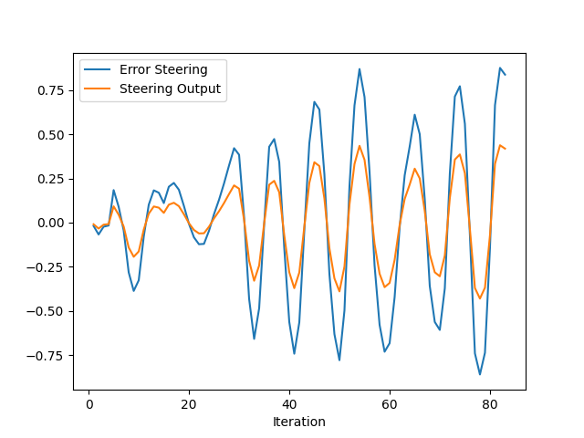
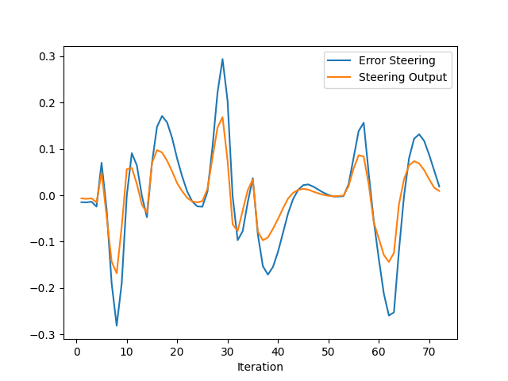
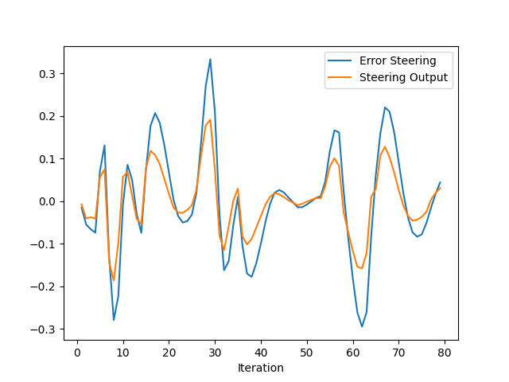

# Control and Trajectory Tracking for Autonomous Vehicle

# Proportional-Integral-Derivative (PID)

In this project, I designed a PID controller to perform vehicle trajectory tracking. The Project consist of 4 steps.

Step 1: Build the PID controller object
Step 2: PID controller for throttle
Step 3: PID controller for steer
Step 4: Evaluate the PID efficiency

Given a trajectory as an array of locations, and a simulation environment in Udacity's workspace, I designed and code a PID controller and test its efficiency on the CARLA simulator used in the industry.

### Installation

Run the following commands to install the starter code in the Udacity Workspace:

Clone the <a href="https://github.com/udacity/nd013-c6-control-starter/tree/master" target="_blank">repository</a>:

`git clone https://github.com/udacity/nd013-c6-control-starter.git`

## Run Carla Simulator

Open new window

* `su - student`
// Will say permission denied, ignore and continue
* `cd /opt/carla-simulator/`
* `SDL_VIDEODRIVER=offscreen ./CarlaUE4.sh -opengl`

## Compile and Run the Controller

Open new window

* `cd nd013-c6-control-starter/project`
* `./install-ubuntu.sh`
* `cd pid_controller/`
* `rm -rf rpclib`
* `git clone https://github.com/rpclib/rpclib.git`
* `cmake .`
* `make` (This last command compiles your c++ code, run it after every change in your code)

## Testing

To test your installation run the following commands.

* `cd nd013-c6-control-starter/project`
* `./run_main_pid.sh`
This will silently fail `ctrl + C` to stop
* `./run_main_pid.sh` (again)
Go to desktop mode to see CARLA

If error bind is already in use, or address already being used

* `ps -aux | grep carla`
* `kill id`

## Project Instructions
In the directory [/pid_controller](https://github.com/hrkssk/nd013-c6-control-starter/tree/master/project/pid_controller)  I coded the files [pid_controller.cpp]https://github.com/hrkssk/nd013-c6-control-starter/blob/master/project/pid_controller/pid_controller.cpp)  and [pid_controller.h](https://github.com/hrkssk/nd013-c6-control-starter/blob/master/project/pid_controller/pid_controller.h).
The function pid is called in [main.cpp](https://github.com/hrkssk/nd013-c6-control-starter/blob/master/project/pid_controller/main.cpp).

### Step 1: Build the PID controller object
Run the simulator and see in the desktop mode the car in the CARLA simulator. The car did not move in the simulation. 
 

### Step 2: PID controller for throttle:
The function pid is called in [main.cpp](https://github.com/hrkssk/nd013-c6-control-starter/blob/master/project/pid_controller/main.cpp).

### Step 3: PID controller for steer:
The function pid is called in [main.cpp](https://github.com/hrkssk/nd013-c6-control-starter/blob/master/project/pid_controller/main.cpp).

### Step 4: Evaluate the PID efficiency
Ths is the results of the first test. The vehicle can't pass the car and crash to the wall. 
I used Kp = 0.1, Kd = 0.0, Ki = 0.0.The values of the error are below. 
 
 

To Tune the parameters of the pid, I reffered the link below. 
Following the content of the links, I used "pid_throttle.Init(0.20,0.001,0.02, 1, -1)".

[What are good strategies for tuning PID loops?](https://robotics.stackexchange.com/questions/167/what-are-good-strategies-for-tuning-pid-loops#:~:text=To%20tune%20a%20PID%20use%20the%20following%20steps%3A,D%20to%20the%20last%20stable%20values.%20More%20items) 

[How should we adjust the PID parameters when a output of the machine is bounded in a range?](https://knowledge.udacity.com/questions/941484) 

####  step 4-1: Set all gains to zero and Increase the $P$ gain until the response to a disturbance is steady oscillation.
I used Kp = 0.5, Kd = 0.0, Ki = 0.0. 
I got enogh response to a disturbance, however steering error was oscillated.
 
 

#### step 4-2: Increase the $D$ gain until the oscillations go away.
I used Kp = 0.5, Kd = 0.3, Ki = 0.0. the oscillations was decay, however one of the several tests had a little oscillating. 
 
 

#### step 4-3: Increase the $I$ gain until getting stable control.
I used Kp = 0.5, Kd = 0.3, Ki = 0.005. the oscillations was decay, and I got stable control. 
 
 

Answer the following questions:
- Add the plots to your report and explain them (describe what you see)
- What is the effect of the PID according to the plots, how each part of the PID affects the control command?
  Kp controls the response to a disturbance.
  Kd and Ki controls the decay of the oscillation from the response.
- How would you design a way to automatically tune the PID parameters?
  First, We increase Kp as quickly as the response to avoid the collision to the obstacles.
  Then increase Kd and Ki until the oscillation stops
- PID controller is a model free controller, i.e. it does not use a model of the car. Could you explain the pros and cons of this type of controller?
  the pros is that we don't have to create a model for each car.
  the cons is that PID can not complete to optimize the car dynamics.
- (Optional) What would you do to improve the PID controller?

### Tips:

- When you wil be testing your c++ code, restart the Carla simulator to remove the former car from the simulation.
- If the simulation freezes on the desktop mode but is still running on the terminal, close the desktop and restart it.
- When you will be tuning the PID parameters, try between those values:
