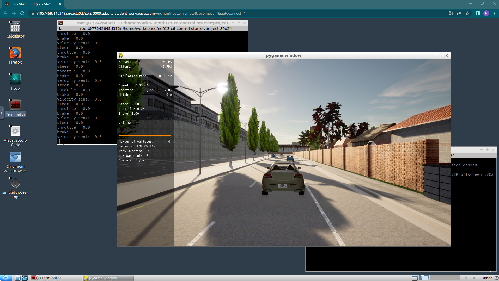
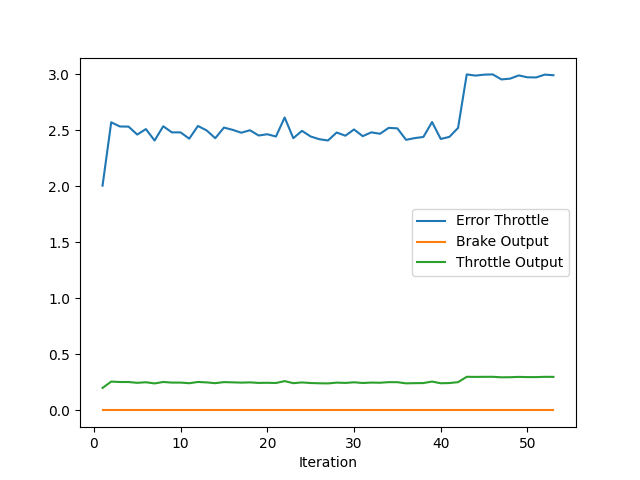
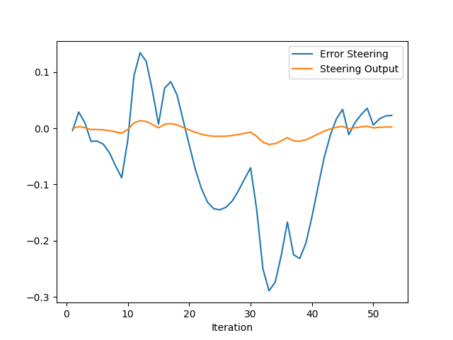

# Control and Trajectory Tracking for Autonomous Vehicle

# Proportional-Integral-Derivative (PID)

In this project, I designed a PID controller to perform vehicle trajectory tracking. The Project consist of 4 steps.

Step 1: Build the PID controller object
Step 2: PID controller for throttle
Step 3: PID controller for steer
Step 4: Evaluate the PID efficiency

Given a trajectory as an array of locations, and a simulation environment in Udacity's workspace, I designed and code a PID controller and test its efficiency on the CARLA simulator used in the industry.

### Installation

Run the following commands to install the starter code in the Udacity Workspace:

Clone the <a href="https://github.com/udacity/nd013-c6-control-starter/tree/master" target="_blank">repository</a>:

`git clone https://github.com/udacity/nd013-c6-control-starter.git`

## Run Carla Simulator

Open new window

* `su - student`
// Will say permission denied, ignore and continue
* `cd /opt/carla-simulator/`
* `SDL_VIDEODRIVER=offscreen ./CarlaUE4.sh -opengl`

## Compile and Run the Controller

Open new window

* `cd nd013-c6-control-starter/project`
* `./install-ubuntu.sh`
* `cd pid_controller/`
* `rm -rf rpclib`
* `git clone https://github.com/rpclib/rpclib.git`
* `cmake .`
* `make` (This last command compiles your c++ code, run it after every change in your code)

## Testing

To test your installation run the following commands.

* `cd nd013-c6-control-starter/project`
* `./run_main_pid.sh`
This will silently fail `ctrl + C` to stop
* `./run_main_pid.sh` (again)
Go to desktop mode to see CARLA

If error bind is already in use, or address already being used

* `ps -aux | grep carla`
* `kill id`

## Project Instructions
In the directory [/pid_controller](https://github.com/hrkssk/nd013-c6-control-starter/tree/master/project/pid_controller)  I coded the files [pid_controller.cpp]https://github.com/hrkssk/nd013-c6-control-starter/blob/master/project/pid_controller/pid_controller.cpp)  and [pid_controller.h](https://github.com/hrkssk/nd013-c6-control-starter/blob/master/project/pid_controller/pid_controller.h).
The function pid is called in [main.cpp](https://github.com/hrkssk/nd013-c6-control-starter/blob/master/project/pid_controller/main.cpp).

### Step 1: Build the PID controller object
Run the simulator and see in the desktop mode the car in the CARLA simulator. The car did not move in the simulation.

### Step 2: PID controller for throttle:
The function pid is called in [main.cpp](https://github.com/hrkssk/nd013-c6-control-starter/blob/master/project/pid_controller/main.cpp).

### Step 3: PID controller for steer:
The function pid is called in [main.cpp](https://github.com/hrkssk/nd013-c6-control-starter/blob/master/project/pid_controller/main.cpp).

### Step 4: Evaluate the PID efficiency
Ths is the results of the first test. The vehicle can't pass the car and crash to the wall.
I used Kp = 0.1, Kd = 0.0, Ki = 0.0.
The values of the error are below.

To Tune the parameters of the pid, I tried Ziegler–Nichols method.
[Ziegler–Nichols method](https://en.wikipedia.org/wiki/Ziegler%E2%80%93Nichols_method)

####  step 4-1: Set all gains to zero and Increase the $P$ gain until the response to a disturbance is steady oscillation. it reaches the ultimate gain $K_u$.

#### step 4-2: $K_u$ and the oscillation period $T_u$ are are then used to set the $P$, $I$, and $D$ gains.

$$K_p = 0.6 * K_u$$ \
$$K_i = 1.2 * K_u /T_u$$ \
$$K_d = 0.075 * K_u * T_u$$ \

Answer the following questions:
- Add the plots to your report and explain them (describe what you see)
- What is the effect of the PID according to the plots, how each part of the PID affects the control command?
- How would you design a way to automatically tune the PID parameters?
- PID controller is a model free controller, i.e. it does not use a model of the car. Could you explain the pros and cons of this type of controller?
- (Optional) What would you do to improve the PID controller?

### Tips:

- When you wil be testing your c++ code, restart the Carla simulator to remove the former car from the simulation.
- If the simulation freezes on the desktop mode but is still running on the terminal, close the desktop and restart it.
- When you will be tuning the PID parameters, try between those values:
